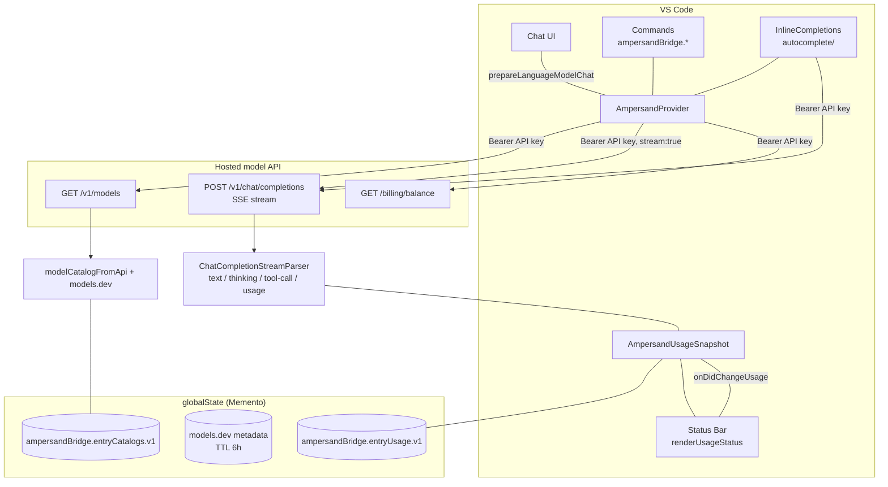

# Development

## Prerequisites

- Node.js 22, 24, or 26 (CI matrix)
- npm; `package-lock.json` is authoritative

```bash
npm ci          # clean dependency install
npm test        # clean compile, then all node:test suites
npm run package # full validation plus VSIX packaging
```

Run `npm test` for code changes. Also run `npm run package` when changing the
manifest, packaging rules, dependencies, or release-facing content. Press F5
with the repository launch configuration for an Extension Development Host.

## Live checks

Ampersand Bridge talks to the public [ai&](https://docs.aiand.com) API. In the
Extension Development Host, add a provider entry in Manage Language Models with
a real ai& API key, then run **Ampersand Bridge: Test Inference**,
**Refresh Models**, and **Show Usage and Credits**. Optionally put
`AMPERSAND_API_KEY` in a git-ignored `.env` for the model-resync script:

```bash
node scripts/refresh-models.mjs            # report drift only
node scripts/refresh-models.mjs --apply    # edit bundled metadata + changeset
node scripts/refresh-models.mjs --pr       # open a resync pull request
```

The script probes the live `/v1/models` catalog (with models.dev as
supplemental metadata), recompiles `out/` when sources are newer than the
build, and never prints or stores the key.

## Architecture



Key properties:

- Native provider entries require a unique stable `entryId`; VS Code owns the
  API keys and the extension keeps provisioned keys only in memory. Rotations
  retire stale model handles, and forgotten entry IDs persist as tombstones.
- The live `/v1/models` response, including an empty directory, is
  authoritative for that entry and persisted per credential. A refused key
  (HTTP 401/403) lists no models. Cached or fallback models are served only
  when a refresh fails.
- Streaming is incremental. A request-scoped reporter emits thinking before
  text, closes it before tools and at every terminal path, and assigns
  distinct fallback call IDs. The SSE parser joins indexed and ID-only
  fragments for parallel tools and accepts CRLF split across transport chunks.
- The service streams reasoning under `delta.reasoning` (verified live
  2026-10-09); the parser also accepts the `reasoning_content` spelling some
  dialects use.
- Balance usage is fetched live per entry and never persisted; only locally
  tracked token/cost activity survives restarts, scoped per credential.
- Retries are pre-stream only, on network errors and HTTP 429/502/503/504, and
  never retry cancellation or a started stream.

## Provider invariants

- Use the fixed endpoints from `src/transport/protocol.ts` with the extension's
  own user agent.
- Treat a successful live `/v1/models` response as authoritative for that key.
- Never widen a live per-model reasoning-effort list with metadata, and never
  send an effort outside the list.
- Do not guess model prices or send undocumented request fields.
- Keep prompts, tool arguments, responses, and keys out of logs and fixtures.

## Release flow

User-visible changes require a Changeset. The release workflow creates a
version PR, runs the complete package check, publishes the VSIX to the Visual
Studio Marketplace as `grikomsn.ampersand-bridge-copilot-chat`, and creates a
matching GitHub release.

## Sources

- [ai& API keys](https://console.aiand.com/settings/api-keys)
- [models.dev](https://models.dev/)
